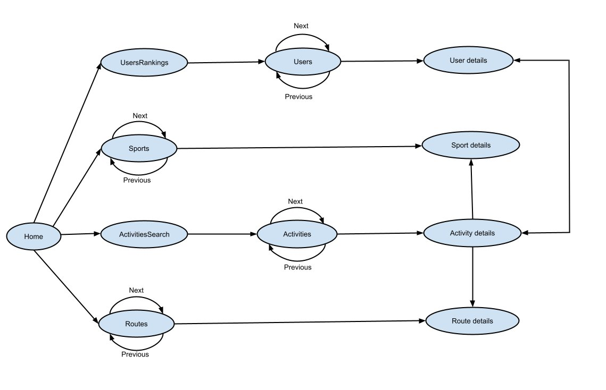

## Introduction

This document describes the requirements for the second phase of the Software Laboratory project.

## Requirements

### Paging

All Web API `GET` operations that return a sequence should support _paging_, i.e., the ability to return a subsequence from the overall sequence.
This paging is defined by two parameters:

* `limit` - length of the subsequence to return.
* `skip` - start position of the subsequence to return.

For example, the request `GET /users?skip=6&limit=3` returns the `users` subsequence starting at the seventh user and ending on the ninth user.

### Additional Operations
 
* Delete a set of activities, given the following additional information:
  * `activities` - a set with the activities ids to remove 

* Get the list of users that have an activity, given the following parameters:
  * `sid` - sport's identifier
  * `rid` - route's identifier

The list should be sorted by activity duration.
 
### Single Page Application

The main requirement for the second phase is the delivery of a [Single Page Application (SPA)](https://developer.mozilla.org/en-US/docs/Glossary/SPA) to provide a Web User Interface to the `GET` operations developed in the first phase.

In this repository there are two examples of simple Single Page Applications:
1. [A simple one](https://github.com/isel-leic-ls/2122-2-common/tree/main/static-content/spasimple)
2. [One more complete using a router](https://github.com/isel-leic-ls/2122-2-common/tree/main/static-content/sparouter)

To see these two examples working, you must launch the HTTPServer application on `file pt.isel.ls.http.HttpServer.kt` and go to the following URI on your web browser: `http://localhost:9000/`

Note that the routes in `file pt.isel.ls.http.HttpServer.kt` have been updated.

The UI responses for any successful requests, must comply to the following:

* When the corresponding API response contains an array, the HTML view must include a link to each element detail.
For instance, the HTML generated on a successful `GET` to `/users` must include links to each user's details.

* All HTML views must contain links required to ensure the navigability defined in the following graph:

* All views must include links to `home`, `users`, `sports`, `routes` and `activities`.

## Report

The technical report created for phase 1 should be updated and/or extended with the relevant technical information.
The sections developed for phase 1 can be improved or changed.
There should **not** be a separate report for phase 2.
The goal is to have a single report, updated through all the project phases.
