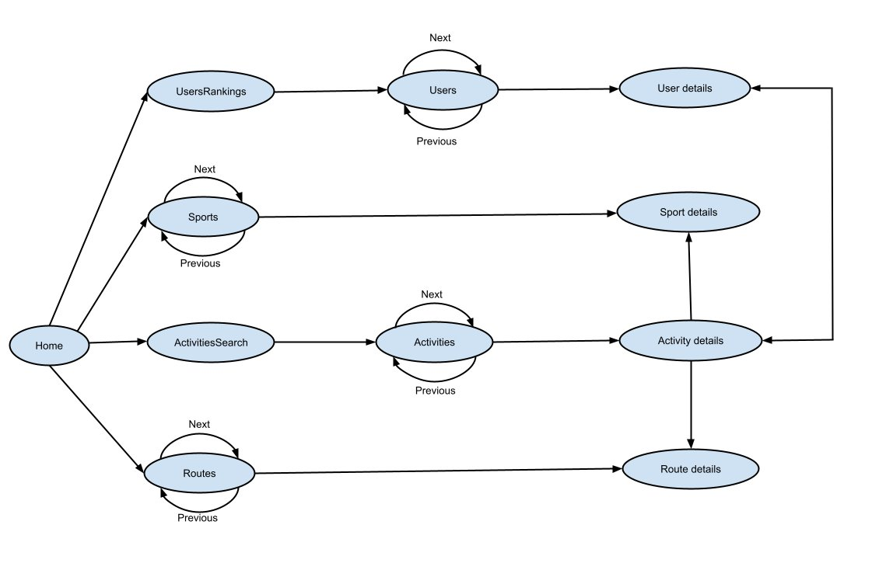

# [Phase 3](https://github.com/isel-leic-ls/2122-2-common/wiki/phase-3)

## Introduction
We design and implement an information system and server that uses a web-API, to manage (create, delete and search (and consult)) physical activities (sports), like running or cycling 

We also developed a Single Page Application that provides a Web User Interface to the GET, POST, PUT and DELETE requests. And allows the user to navigate through the server's data with links

## Operations added in this phase
- Added operations for the user to login and register in the server. The server stores hashed passwords. And the hash of a user is returned upon logging in or registering. Various checks about the validity of a registeration or login are made, like checking if the email is well formatted, if the email is already in use upon registration, the indication that a password is incorrect, etc.
- Added means of deploying our app in Heroku

## Schema with the new paths of the SPA

## Modeling the database
### **Conceptual model**
The following diagram holds the Entity-Relationship model for the information managed by the system.

We highlight the following aspects:
- We use a Jetty (HTTP) server that defines a web-API to get and edit data 
- This data can be stored in memory or in postgresql database (if the program argument's is: "postgres")
- We use POSTMAN to simulate HTTP Requests, like GET, POST ,PUT and DELETE

The conceptual model has the following restrictions:
- An Activity may or not have a reference to a Route
- The fields email and uuid must be unique
    
### **Physical Model**

The following diagram holds the Database schema / relation model for the information managed by the system.

 

We highlight the following aspects of this model:
- The field routeID may be null

# Software organization

### **Open-API Specification**

- [YAML file](https://github.com/isel-leic-ls/2122-2-LEIC41N-G01/blob/main/DOCS/open-api.yaml)

In our Open-API specification, we highlight the following aspects:

- Each entity can be obtained via it's unique itentifier using a GET request given it's id(primary key)
- All entities can be obtained via a GET request (with or without parameters, see the yaml file)
- Any type of entity can be sent via a POST request in order to be added to the datasource if the request body has a correct format
- Plus, the entity Activity has extra specifications, like a GET request to get all Activities tied to a given the Sport ID and a limit on how many tuples it's meant to look for. And the same thing but for a User. It's also possible to delete an Activity given it's ID

## SPA demonstrations of new functionalities with pictures
### Users search
Note that there's no need to type out the complete name of a sport or route or ommit details of the search(per example no endLocation is specified). It shows results based on similarity (based on existing parts of a strings in the name of a sport or route). In the checkboxes, it's built so that only 1 route can be selected. If no sports or routes is found matching the search, an alert message is shown

### Route creation (similar way with sports)

### Activity creation

### **Use-Case Scenario and how requests are processed**

A Request is funeled through it's proper handler (methods that receive these requests) as defined by the list in Routes indicaded in sports-server.kt

### **In the *webapi* package:**
Once the proper method is called for the indicaded Request, a number of basic checks are done. Per example, a POST request to create a user, should come with a proper Request Body (these are defined in *pt.isel.ls.api.utils/sports-dataclass-in*). This is done via a method called `getRequestBody()` witch performs a `Json.decodeFromString<T>()` method call. Other Requests *can* come with a Paging query parameter and other mandatory or optional parameters, that are also computed. At the end, method calls to *services* classes are made and the responses are built by instantiating the proper data classes from *utils/sports-dataclass-out.kt* and returned.

### **In the *services* package:**
The classes in this package compute obtain the data from the datasource and compute the result of the queries which are conditioned by the parameters that are provided (per example, Paging)

### **How and where command parameters are validated**
We have 3 main exceptions types in our server: `NotFoundException` (404), `AuthenticationException`(401) and `BadRequestException`(400).
There are levels to each validations of the parameters. The classes in the *webapi* package throw higher level exceptions, while *services* throws lower level exceptions or warnings (per example `NotFoundException`). 

### **Connection Management**
All connections to the DB are AutoCloseable because of the use of the ".use" block. Connections are open while querrying and altering the database

### **Data Access**
The classes that aid on the data access are:
- All the classes in: *kotlin/pt/isel/ls/api/data/mem* (if the data source is the data in memory)
- All the classes in: *kotlin/pt/isel/ls/api/data/postgres* (if the data source is the data in the postgresql database)
- All the classes in *kotlin/pt/isel/ls/api/service* to access the data source

Some non-trivial (relevant) used SQL statements are:
- CREATE TABLE, in order to create the tables in the DB when starting the application
- SELECT, for getting properties from the tables
- INSERT, for adding more tuples of an Entity
- UPDATE, for updating route, sport or activity
- DELETE, in order to delete 1 activity (and we also have a POST request to delete several activities)

### **Paging**
To facilitate and properly make use of paging functionalities we created a Paging class data class. The Paging object is described by the parameters `limit` and `skip`, which are initialized and checked for their proper ranges.

Now this object is passed to the data-classes (in *src/main/kotlin/pt/isel/ls/api/data/*) and these classes are the ones that compute the results. (Before we were getting everything from the database and then paging it with `computeRangeForPaging`, but now it's fixed)

### **Error Handling/Processing**
Per example, when a querry doesn't find a tuple with a certain ID, we return empty lists. When requests are incomplete or malformed, the server returns an appropriate status code. In some instances it is displayed has an alert message in the SPA. In the *activities* portion of the page, if *sid* or *orderBy* are not indicaded or not properly indicaded, an alert box is shown displaying the error: 

## **Critical Evaluation**
We're confident that we did a good job. All the objectives were met. We wrote many tests and we have good and organized server-side code. But in regards to the SPA we could have simplified the routerering of paths, divide and simplify code between more files and the logic behind the next-previous buttons.
